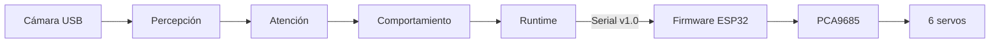
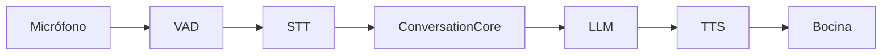

# SIRAH

<p align="center">
  
</p>

<p align="center">
  <a href="https://www.facebook.com/profile.php?id=61592100517778&amp;locale=es_LA"></a>
  &nbsp;
  <a href="https://www.instagram.com/comunidadrobotica.itcm/"></a>
</p>

<p align="center">
  
  
  
</p>

## Sobre SIRAH

SIRAH (Sistema Inteligente Robótico de Asistencia Humana) es un robot
humanoide educativo del [Instituto Tecnológico de Ciudad Madero](https://www.itcm.edu.mx/)
(ITCM), desarrollado en el Taller de Robótica con colaboración del IPT de
Tampico Centro.

Este repositorio contiene el software: un runtime que controla ojos con
expresión, visión por cámara y un laboratorio conversacional por voz.

Es un prototipo en desarrollo. Lo estable se puede probar sin hardware; lo
experimental está marcado como tal.

## Estado actual

| Subsistema | Estado | Requisitos |
|---|---|---|
| Runtime de ojos: Python + firmware ESP32 (mirada, párpados, parpadeo, límites seguros) | Estable | Hardware real opcional; FakeESP32 para pruebas |
| Protocolo PC ↔ ESP32 v1.0 | Estable | — |
| Visión: cámara + detección facial; gestos y personas | Experimental | Webcam USB + modelos |
| Conversación por voz: VAD → STT → LLM → TTS | Laboratorio | Micrófono, bocina y configuración de proveedores |

La conversación no envía comandos al hardware. Su contrato de acción permanece
limitado a `none`; visión y conversación son opt-in.

## Arquitectura

Dos caminos separados: los ojos (runtime Python + firmware ESP32) y la
conversación (audio y voz). La conversación no llega al hardware.





La cámara publica el frame más reciente en `FrameBroker`. Los workers de
percepción lo procesan fuera del loop principal. El detalle está en
[docs/architecture.md](docs/architecture.md).

## Requisitos y hardware

### Software

- Python ≥ 3.12
- [`uv`](https://docs.astral.sh/uv/)

### Hardware

| Componente | Para qué | ¿Cuándo es necesario? |
|---|---|---|
| ESP32 + PCA9685 + 6 servos + fuente externa 5 V | Ojos físicos | Solo para ojos reales |
| Webcam USB | Visión | Opcional |
| Micrófono y bocina | Conversación | Opcional |
| Ninguno | Probar con FakeESP32, replay y tests | Primer contacto |

## Instalación

```bash
git clone https://github.com/Laxxup/SIRAH.git
cd SIRAH

# Ojos (con o sin hardware)
uv sync --extra cli --extra serial

# Visión con cámara
uv sync --extra cli --extra serial --extra perception
uv run sirah-models yunet

# Conversación por voz
uv sync --extra audio --extra vad --extra conversation --extra edge-tts
```

La conversación por voz necesita FFmpeg; instálalo con el gestor de paquetes de
tu sistema (ejemplos por distribución en [docs/conversation.md](docs/conversation.md)).

`uv sync` deja el entorno con exactamente los extras indicados; para
desarrollar, añade `--extra dev` a la línea que uses. Para la voz local, cambia
`--extra edge-tts` por `--extra local-tts`. El detalle de cada extra está en
[docs/development.md](docs/development.md).

## Probar sin hardware

```bash
uv run sirah-runtime --fake --eyes
uv run sirah-conversation replay tests/fixtures/conversation/approved.jsonl
uv run pytest -q
```

- `sirah-runtime --fake --eyes` — FakeESP32 simula en memoria el
  comportamiento esperado del firmware. El runtime arma los ojos sobre esa
  simulación, mantiene el heartbeat y termina limpiamente con Ctrl-C; no abre
  puerto serie ni mueve servos.
- `sirah-conversation replay` — reproduce una conversación grabada de principio
  a fin, sin micrófono, sin red y sin proveedores.
- `pytest -q` — ejecuta la suite completa.

Para probar con hardware físico (ojos reales, visión con cámara o conversación
en vivo) sigue el [inicio rápido](docs/quickstart.md).

## Pruebas

```bash
uv run pytest -q
uv run ruff check .
uv run mypy
make -C firmware/sirah-eyes/tests/host core_tests
```

La explicación de cada suite está en [docs/testing.md](docs/testing.md).

## Documentación

Por intención; el índice completo está en [docs/](docs/README.md).

- **Empezar** — [inicio rápido](docs/quickstart.md) · [guía de conversación](docs/conversation.md)
- **Entender** — [arquitectura](docs/architecture.md) · [estado del proyecto](docs/roadmap.md)
- **Hardware** — [montaje y cableado](docs/hardware/) · [calibración](docs/calibration.md) · [protocolo v1.0](docs/components/protocol.md)
- **Conversación** — [guía de conversación](docs/conversation.md) · [privacidad](docs/privacy.md)
- **Desarrollar** — [entorno de desarrollo](docs/development.md) · [pruebas](docs/testing.md) · [release](docs/release.md) · [contribuir](CONTRIBUTING.md)

## Seguridad y privacidad

- Reporta vulnerabilidades según [SECURITY.md](SECURITY.md).
- La conversación puede enviar la transcripción final a proveedores externos
  solo con `--live`. Qué se envía y qué se guarda: [docs/privacy.md](docs/privacy.md).

## Licencia

Apache License 2.0 — [LICENSE](LICENSE).

## Créditos

El mecanismo ocular toma como referencia conceptual el modelaje 3D de
[EyeMech epsilon 3.2](https://www.youtube.com/watch?v=bAvuMn8QTo4&t=186s)
([@WillCogley](https://www.youtube.com/@WillCogley), CC BY-NC-SA 4.0). SIRAH
no redistribuye material de EyeMech; su firmware, calibración y electrónica
son implementaciones independientes.

Las dependencias incluyen la librería Adafruit PWM Servo Driver
(BSD-3-Clause): [NOTICE](NOTICE).