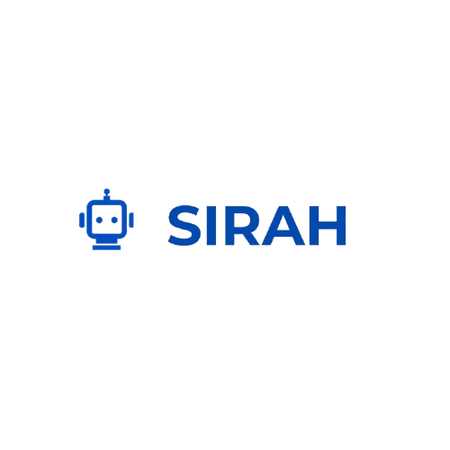

# SIRAH

<p align="center">
  
</p>

<p align="center">
  <a href="https://www.facebook.com/profile.php?id=61592100517778&amp;locale=es_LA"></a>
  &nbsp;
  <a href="https://www.instagram.com/comunidadrobotica.itcm/"></a>
</p>

<p align="center">
  
  
  
</p>

## About SIRAH

SIRAH significa **Sistema Inteligente Robótico de Asistencia Humana**. Es un
proyecto universitario del Instituto Tecnológico de Ciudad Madero (ITCM),
desarrollado en el Taller de Robótica con colaboración del IPT de Tampico
Centro.

El proyecto construye un robot humanoide educativo mediante electrónica,
software, control y sistemas embebidos. Sigue en desarrollo: las funciones
documentadas como experimentales no deben interpretarse como capacidades listas
para producción.

## Estado actual

- Runtime Python con `asyncio`, protocolo PC ↔ ESP32 y `FakeESP32` para pruebas sin hardware.
- Subsistema ocular con mirada 2D, párpados, límites y calibración.
- Laboratorio conversacional con Ollama, capacidades locales, contexto corto y logs opt-in.
- Conversación local experimental con Silero VAD, Faster-Whisper y Kokoro.

La conversación no controla ojos, ESP32, servos ni otro hardware. El contrato
de acción permanece limitado a `none`.

## Inicio rápido

Sin hardware:

```bash
pip install -e ".[cli,serial]"
sirah-runtime --fake --eyes
```

Para conversación y sus requisitos locales, consulta
[docs/conversation.md](docs/conversation.md). Antes de conectar hardware físico,
lee [docs/hardware/](docs/hardware/).

## Pruebas

```bash
uv run pytest -q
uv run ruff check src/sirah tests
uv run mypy src/sirah
```

También hay pruebas de firmware y protocolo:

```bash
make -C firmware/sirah-eyes/tests/host core_tests
make -C firmware/sirah-eyes/tests/host contract_checker
```

## Documentación

- [Arquitectura](docs/architecture.md)
- [Inicio rápido](docs/quickstart.md)
- [Conversación](docs/conversation.md)
- [Roadmap](docs/roadmap.md)
- [Prechecks de release](docs/release.md)
- [Hardware y calibración](docs/hardware/)
- [ADR](docs/adr/)
- [Contribuir](CONTRIBUTING.md)

## Licencia

SIRAH se distribuye bajo [Apache License 2.0](LICENSE).
