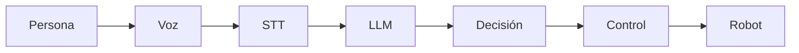
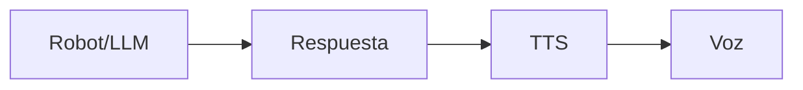
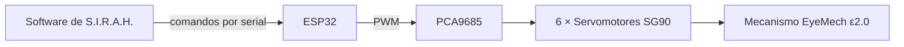

# Proyecto S.I.R.A.H.

**Sistema Inteligente Robótico de Asistencia Humana.**

Robot conversacional que combina un LLM, reconocimiento de voz (STT), síntesis de voz (TTS), visión local y un mecanismo de ojos animados controlado por servomotores. Código fuente: [github.com/Laxxup/SIRAH](https://github.com/Laxxup/SIRAH).

---

## Índice

- [Inicio del proyecto](#inicio-del-proyecto)
- [Primeros recursos](#primeros-recursos)
- [Organización del proyecto](#organización-del-proyecto)
- [Objetivo inicial](#objetivo-inicial)
- [Primer arranque funcional](#primer-arranque-funcional)
- [Capacidades obtenidas durante la etapa experimental](#capacidades-obtenidas-durante-la-etapa-experimental)
- [Sistema de reconocimiento de voz (STT)](#sistema-de-reconocimiento-de-voz-stt)
- [Sistema de generación de voz (TTS)](#sistema-de-generación-de-voz-tts)
- [Desarrollo inicial en Go](#desarrollo-inicial-en-go)
- [Personalidad y comportamiento del agente](#personalidad-y-comportamiento-del-agente)
- [Ollama Cloud y latencia](#ollama-cloud-y-latencia)
- [Sistema de memoria](#sistema-de-memoria)
- [Capacidades visuales pendientes](#capacidades-visuales-pendientes)
- [Arquitectura física del mecanismo](#arquitectura-física-del-mecanismo)
- [Tecnologías utilizadas](#tecnologías-utilizadas)
- [Decisiones técnicas](#decisiones-técnicas)
- [Problemas encontrados durante las primeras pruebas](#problemas-encontrados-durante-las-primeras-pruebas)
- [Estado actual del proyecto](#estado-actual-del-proyecto)
- [Glosario](#glosario)
- [Referencias](#referencias)

---

## Inicio del proyecto

S.I.R.A.H. nació hace ya varios meses, inspirándose en diversas iniciativas relacionadas con la integración de Inteligencia Artificial (IA) dentro de sistemas robóticos. El repositorio de GitHub se creó después: primer commit **2026-09-11** (`b19348b`); primera release: **2026-09-12**.

El propósito principal del proyecto es explorar y demostrar la capacidad de un agente de IA para interactuar con un sistema robótico y controlar diferentes funciones de manera autónoma. Para ello, se busca aplicar los conocimientos adquiridos en las clases de robótica del ITCM, combinándolos con programación, electrónica, diseño mecánico e IA.

El proyecto se plantea como una experimentación progresiva: comenzar con un sistema robótico funcional y, posteriormente, desarrollar e integrar los componentes necesarios para dotarlo de capacidades de percepción, procesamiento, toma de decisiones y asistencia.

## Primeros recursos

Como uno de los primeros recursos para iniciar el desarrollo, se localizó un modelo 3D gratuito perteneciente al Will Cogley Project Archive, correspondiente al mecanismo **EyeMech ε2.0** (repositorio: [will-cogley/EyeMech_Epsilon](https://github.com/will-cogley/EyeMech_Epsilon), licencia CC BY-NC-SA 4.0).

Este modelo se tomó como una de las bases mecánicas iniciales para el desarrollo del proyecto, principalmente para experimentar con los mecanismos de movimiento y establecer una plataforma física sobre la cual posteriormente puedan integrarse los sistemas electrónicos y de control.

Las piezas del mecanismo fueron impresas mediante los recursos disponibles en la secundaria del IPT (impresoras 3D de la institución), lo que permitió comenzar a construir físicamente el prototipo y evaluar la viabilidad del diseño.

## Organización del proyecto

Para mantener organizado el desarrollo de S.I.R.A.H., se creó una carpeta de trabajo destinada a concentrar la documentación, los recursos, el código fuente, modelos, diseños y demás archivos relacionados con el proyecto.

Posteriormente, se creó un repositorio en GitHub para llevar un control más adecuado del código y de las diferentes modificaciones realizadas durante el desarrollo. Esto permitió comenzar a trabajar de manera más estructurada y conservar un registro de los cambios realizados al sistema.

Desde esta etapa se comenzó a documentar el desarrollo de manera progresiva, registrando los avances, problemas encontrados, soluciones implementadas, pruebas realizadas y conocimientos adquiridos durante el proceso.

## Objetivo inicial

El objetivo de esta primera etapa fue establecer una base física y de software sobre la cual pudiera desarrollarse posteriormente el sistema de control inteligente de S.I.R.A.H.

A partir de esta base se plantearon los siguientes objetivos:

- Construcción y adaptación del sistema mecánico.
- Integración de motores y componentes electrónicos.
- Desarrollo del sistema de control.
- Comunicación entre el hardware y el software.
- Integración de Inteligencia Artificial.
- Percepción e interpretación del entorno.
- Procesamiento de voz.
- Toma de decisiones mediante un agente de Inteligencia Artificial.
- Control autónomo del sistema robótico.
- Realización de pruebas y evaluación del comportamiento.
- Documentación de los resultados obtenidos.

Una vez establecida esta base, se comenzó una etapa de experimentación en la que se buscó integrar los diferentes sistemas y conseguir un primer arranque funcional del proyecto.

## Primer arranque funcional

Después de integrar los primeros componentes de software y hardware, se consiguió un primer arranque funcional de S.I.R.A.H.

Esta versión debe considerarse todavía experimental, ya que el objetivo principal en esta etapa era comprobar que los diferentes componentes pudieran comunicarse entre sí y que el agente pudiera interactuar con el sistema robótico.

El primer prototipo permitió comprobar que era posible conectar un agente de IA con el sistema de visión, el sistema de voz y el mecanismo físico.

Sin embargo, durante las pruebas también comenzaron a identificarse diferentes problemas de estabilidad y limitaciones que deberán resolverse en futuras versiones.

## Capacidades obtenidas durante la etapa experimental

A pesar de los problemas encontrados, esta primera etapa permitió conseguir varias funciones importantes.

Actualmente, S.I.R.A.H. cuenta experimentalmente con la capacidad de utilizar un agente para controlar parte del sistema de visión.

Entre las funciones implementadas se encuentran:

- Controlar el movimiento de los ojos mediante órdenes.
- Utilizar la cámara como fuente de información para el agente.
- Detectar rostros.
- Rastrear rostros mediante la cámara.
- Seguir visualmente a una persona.
- Recibir instrucciones mediante voz.
- Convertir audio a texto.
- Procesar el texto mediante un LLM.
- Generar una respuesta mediante el agente.
- Convertir la respuesta generada en voz.
- Reproducir la voz mientras la respuesta continúa generándose.

La integración de estas funciones permitió demostrar que el sistema puede funcionar como una cadena completa de interacción:

y, en sentido contrario:

Esta integración representa uno de los primeros resultados importantes del proyecto.

## Sistema de reconocimiento de voz (STT)

Durante el desarrollo se realizaron diferentes pruebas para encontrar una solución adecuada para convertir la voz en texto.

Inicialmente se experimentó con una solución de procesamiento local. Sin embargo, se presentaron diferentes inconvenientes relacionados con la conversión de voz, especialmente al intentar obtener resultados suficientemente rápidos y estables para una conversación.

Posteriormente se implementó el uso de **Groq mediante API y streaming** para STT, lo que permitió obtener una respuesta más adecuada para las necesidades del proyecto.

El uso de streaming es especialmente importante para S.I.R.A.H., debido a que el objetivo es reducir el tiempo entre el momento en que una persona habla y el momento en que el sistema puede comenzar a procesar la información.

Esta solución representa una mejora respecto a las primeras pruebas, aunque todavía existen problemas cuando participan varias personas o existe ruido en el entorno.

## Sistema de generación de voz (TTS)

Para la generación de voz se realizaron diferentes pruebas con servicios de síntesis de voz.

Se experimentó con una solución basada en Azure mediante **Edge-TTS** y una biblioteca de Python. Posteriormente se decidió volver a utilizar **Piper TTS** de manera local (versión 1.7.0).

El uso de Piper permite realizar la síntesis de voz sin depender completamente de un servicio externo.

Además, se implementó una estrategia experimental de reproducción progresiva de la respuesta. En lugar de esperar a que el LLM termine de generar toda la respuesta, el texto puede enviarse al sistema de síntesis de voz progresivamente.

De esta manera, S.I.R.A.H. puede comenzar a pronunciar las primeras palabras mientras el modelo continúa generando el resto de la respuesta.

El objetivo de esta estrategia es disminuir la latencia percibida y hacer que la interacción resulte más natural.

## Desarrollo inicial en Go

La primera versión del software comenzó a desarrollarse utilizando **Go** (versión 1.27 según `go.mod`).

La elección de este lenguaje estuvo relacionada principalmente con la búsqueda de un sistema eficiente y con buen rendimiento para la comunicación entre los diferentes componentes.

Sin embargo, conforme aumentó la cantidad de componentes integrados, se identificaron algunas dificultades para mantener y extender rápidamente el sistema.

Por este motivo, se está considerando una reestructuración de la arquitectura y una migración progresiva hacia **Python**.

La intención de esta migración no es únicamente cambiar el lenguaje de programación, sino aprovechar la oportunidad para reorganizar el proyecto y solucionar problemas encontrados durante el desarrollo de la primera versión.

## Personalidad y comportamiento del agente

Uno de los problemas que actualmente tiene mayor importancia no está relacionado directamente con el movimiento del robot, sino con la forma en la que el agente se comunica.

El objetivo del proyecto no es únicamente conseguir que S.I.R.A.H. responda preguntas, sino conseguir que pueda mantener una interacción que resulte natural y consistente.

Durante las pruebas se observó que los modelos de lenguaje utilizados pueden generar respuestas correctas, pero eso no significa necesariamente que el agente tenga una personalidad estable o que mantenga una forma de hablar coherente durante una conversación prolongada.

También se realizaron pruebas con diferentes modelos disponibles gratuitamente, incluyendo modelos de distintos tamaños mediante Ollama y otros proveedores.

Una de las dificultades encontradas es que aumentar el tamaño o capacidad del modelo no garantiza por sí mismo una personalidad más natural. Además, los modelos con mayor capacidad de razonamiento pueden aumentar considerablemente el tiempo de respuesta.

Por este motivo, se investigó el concepto de **tarjetas de personalidad** (character cards), utilizadas para establecer características y comportamiento de agentes conversacionales (ver `docs/character-cards.md` en el repositorio).

A partir de esta investigación surgió la idea de crear una personalidad propia para S.I.R.A.H. mediante una estructura en JSON, aprovechando la compatibilidad experimental disponible en el sistema utilizado.

La intención es que esta estructura permita definir características como:

- Personalidad.
- Forma de hablar.
- Actitud.
- Relación con las personas.
- Comportamiento durante una conversación.
- Información relevante sobre S.I.R.A.H.
- Reglas de comportamiento.
- Contexto del proyecto.

Esta parte se implementó como perfiles intercambiables (commit `583bafc`, 2026-09-12) y todavía deberá probarse durante la reconstrucción del sistema.

## Ollama Cloud y latencia

También se realizaron pruebas utilizando Ollama Cloud como alternativa para el funcionamiento del LLM.

Durante estas pruebas se observó que la configuración del nivel de razonamiento tiene un impacto importante en la latencia.

Al establecer el razonamiento en niveles bajos o desactivarlo, el tiempo necesario para obtener una respuesta disminuye considerablemente.

Sin embargo, esta reducción también puede afectar la calidad del flujo conversacional, ya que el modelo dispone de menos capacidad para realizar procesos de razonamiento antes de responder.

Esto genera uno de los principales compromisos actuales del proyecto:

- Mayor razonamiento → mayor tiempo de respuesta.
- Menor razonamiento → menor latencia, pero potencialmente menor profundidad y continuidad en la conversación.

Encontrar un equilibrio entre ambos factores será necesario para conseguir una interacción que se sienta natural.

## Sistema de memoria

Para proporcionar memoria al agente se comenzó a utilizar un servicio gratuito de **Zep** (`github.com/getzep/zep-go/v3`; historial local por defecto y memoria persistente opcional mediante Zep con `ZEP_API_KEY`).

El objetivo principal de esta implementación es permitir que S.I.R.A.H. pueda conservar información importante mencionada durante las conversaciones.

Una de las primeras aplicaciones consiste en recordar nombres y determinados datos proporcionados anteriormente por las personas.

Sin embargo, actualmente existe una limitación importante: S.I.R.A.H. puede recordar un nombre, pero todavía no puede determinar de manera suficientemente confiable quién es la persona que está hablando.

Por esta razón, el sistema de memoria todavía no puede considerarse completamente integrado con el sistema de percepción.

En futuras versiones será necesario relacionar la memoria con la identificación de personas para que el agente pueda determinar no solamente qué recuerda, sino también de quién lo recuerda.

## Capacidades visuales pendientes

Aunque el sistema ya puede detectar y rastrear rostros, sus capacidades de percepción todavía son limitadas.

Actualmente S.I.R.A.H. no cuenta con un sistema suficientemente desarrollado para interpretar de manera general su entorno.

Entre las capacidades que todavía necesitan desarrollarse se encuentran:

- Reconocimiento confiable de colores.
- Reconocimiento de patrones.
- Identificación de objetos.
- Comprensión más completa de una escena.
- Identificación de diferentes personas.
- Seguimiento simultáneo de varias personas.
- Selección de una persona específica como objetivo.
- Relación entre una persona observada y la información almacenada en la memoria.

Estas funciones representan una parte importante del trabajo futuro relacionado con la visión artificial.

## Arquitectura física del mecanismo

La parte mecánica del sistema se basa en el mecanismo EyeMech ε2.0, cuyas piezas fueron obtenidas a partir del modelo 3D mencionado anteriormente.

Para controlar los servomotores se utiliza un **ESP32**, conectado a un controlador **PCA9685**.

Los servomotores del mecanismo se conectan a los diferentes canales del PCA9685, permitiendo controlar individualmente los movimientos necesarios del mecanismo (6 servos SG90: ojos, párpados, mirada, parpadeo, expresiones).

La alimentación de los servomotores se realiza mediante una fuente estable de aproximadamente 5 V, utilizando una conexión USB dedicada, con masa común con la lógica.

De manera simplificada, la arquitectura física actual puede representarse como:

Cada componente actúa como una etapa: el software calcula los movimientos, el ESP32 traduce los comandos al protocolo de hardware, el PCA9685 genera las señales PWM para cada servo y los servos mueven el mecanismo. El flujo de energía (5 V por USB) y la masa común se manejan por separado del canal de control.

> Si tienes una foto del circuito real, podemos incrustarla aquí con ``.

Esta separación permite que el procesamiento de IA y la lógica principal del sistema se mantengan en el software, mientras que el ESP32 se encarga de actuar como interfaz con el hardware (protocolo serial; `internal/firmware`).

## Tecnologías utilizadas

Debido a las necesidades económicas del proyecto y a su naturaleza experimental, se ha buscado utilizar principalmente herramientas gratuitas, de código abierto, locales o con planes gratuitos.

| Función | Tecnología | Estado | Uso actual |
| --- | --- | --- | --- |
| Texto a voz (TTS) | Piper 1.7.0 | Actual | Procesamiento local |
| Voz a texto (STT) | Groq API | Actual | Streaming |
| LLM principal | Proveedor compatible con OpenAI (`/chat/completions`) | Actual | API con streaming SSE |
| LLM probado | OpenRouter, Gemini (tier gratuito) | Probado | Créditos / límites gratuitos |
| LLM alternativo | Ollama Cloud | Probado | Servicio en la nube |
| LLM experimental | Ollama (modelos locales) | Probado | Pruebas locales |
| Memoria | Zep / historial local | Actual | Persistencia opcional entre sesiones |
| Detección facial | OpenCV 4 + YuNet | Actual | Visión opt-in |
| Captura/reproducción de audio | `arecord` / `aplay` (ALSA) | Actual | Modo voz |
| Controlador | ESP32 + PCA9685 | Actual | Comunicación con el mecanismo |
| Servomotores | 6 × SG90 | Actual | Ojos, párpados, expresiones |
| Mecanismo | EyeMech ε2.0 (Will Cogley) | Actual | Plataforma mecánica |
| Lenguaje inicial | Go 1.27 | Actual | Arquitectura actual |
| Lenguaje planeado | Python | Planeado | Próxima arquitectura |

## Decisiones técnicas

| Decisión | Alternativas consideradas | Motivo |
| --- | --- | --- |
| STT con Groq (streaming) | Solución local de STT | Resultados más rápidos y estables para conversación; el local no cumplía latencia |
| TTS con Piper (local) | Edge-TTS (Azure), Piper vs. servicios externos | No depender de servicio externo; síntesis local
| Reproducción progresiva de la respuesta del LLM | Esperar la respuesta completa | Reducir latencia percibida; conversación más natural |
| Mecanismo base EyeMech ε2.0 | Diseño propio | Modelo 3D gratuito y probado; base para experimentar |
| Go como primer lenguaje | Python directamente | Eficiencia y rendimiento en comunicación entre componentes |
| Migración a Python | Mantener Go | Facilidad de mantenimiento/extensión y ecosistema de IA |
| Memoria con Zep | Memoria simple en archivo/BD propia | Conversaciones con nombres y datos previos; opción gratuita disponible |
| Personalidad en character cards JSON | Solo prompt en código | Personalidad intercambiable y separada del contexto (commit `583bafc`) |
| Visión opt-in | Activada por defecto | No todos los usos necesitan cámara; simplifica el modo texto |
| OpenCV 4 por defecto | OpenCV 5 | Ruta validada por CI (`8e88daf`); OpenCV 5 como tag opcional |

## Problemas encontrados durante las primeras pruebas

### Reconocimiento de voz en ambientes con varias personas

Uno de los primeros problemas identificados se presentó en el sistema de reconocimiento de voz.

Cuando existe una sola persona hablando y el ambiente es relativamente controlado, el sistema puede procesar la voz adecuadamente. Sin embargo, cuando existe una cantidad mayor de personas alrededor, el sistema presenta dificultades para determinar qué voz debe reconocer.

Esto provoca que el texto obtenido mediante el sistema de STT pueda contener errores o que S.I.R.A.H. no pueda determinar correctamente quién está hablando.

Por el momento, el sistema no cuenta con un mecanismo suficientemente robusto de identificación y seguimiento del hablante.

### Seguimiento mediante cámara

Otro problema identificado se encuentra en el sistema de seguimiento de rostros.

Actualmente, S.I.R.A.H. puede detectar rostros y utilizar esta información para controlar el movimiento de los ojos. Sin embargo, el sistema fue diseñado inicialmente para trabajar en escenarios relativamente sencillos.

Cuando aparecen varias personas al mismo tiempo dentro del campo de visión de la cámara, el sistema no cuenta todavía con una estrategia suficientemente robusta para determinar qué persona debe seguir.

Esto puede provocar cambios inesperados en el objetivo del seguimiento o que el sistema pierda a la persona que estaba siguiendo.

Por esta razón, una de las tareas de la siguiente versión será mejorar la selección, identificación y seguimiento de personas.

### Problemas relacionados con los modelos de lenguaje

Otro de los principales problemas encontrados corresponde al modelo de lenguaje utilizado como base para el agente.

Actualmente el proyecto no dispone de un modelo de lenguaje propio con recursos suficientes para realizar todas las pruebas de manera continua. Por esta razón, durante el desarrollo se han utilizado diferentes servicios que ofrecen planes gratuitos, créditos de prueba o límites de uso (OpenRouter, Groq, Gemini en nivel gratuito, Ollama Cloud, modelos locales con Ollama).

El uso de estas alternativas permitió continuar con el desarrollo sin depender inicialmente de un presupuesto elevado para infraestructura de IA.

Sin embargo, esta estrategia también introdujo nuevos problemas. Los servicios gratuitos tienen límites de uso y pueden experimentar saturación. Cuando un modelo se encuentra saturado, la respuesta puede presentar una latencia considerablemente mayor o el servicio puede dejar temporalmente de responder.

Por lo tanto, uno de los principales objetivos de la siguiente versión será diseñar el sistema de manera que pueda tolerar mejor los fallos o la indisponibilidad temporal de un proveedor.

## Estado actual del proyecto

Después de esta primera etapa de experimentación, S.I.R.A.H. puede considerarse un prototipo funcional experimental.

El sistema ya es capaz de integrar diferentes componentes que normalmente funcionarían de manera independiente: visión, reconocimiento de voz, modelos de lenguaje, síntesis de voz, memoria y control de un mecanismo físico.

El principal resultado de esta etapa no consiste únicamente en las funciones que se lograron implementar, sino también en la identificación de las limitaciones que deberán solucionarse para conseguir una versión más estable.

| Capacidad | Estado |
| --- | --- |
| Conversación por texto (terminal) | Funcional |
| Conversación por voz (`-voice`) | Funcional (STT Groq + Piper) |
| Detección y seguimiento facial (OpenCV/YuNet) | Funcional, opt-in |
| Ojos animados (6 servos SG90, ESP32 + PCA9685) | Funcional |
| Memoria conversacional (local + Zep opcional) | Funcional |
| Character cards / perfiles de personalidad | Implementado (experimental) |
| Identificación robusta del hablante | Pendiente |
| Selección de persona a seguir entre varias | Pendiente |
| Visión general (objetos, colores, patrones) | Pendiente |
| Migración/reorganización a Python | Planeada |

Actualmente, los principales problemas identificados son:

- Reconocimiento de voz poco confiable cuando participan varias personas.
- Falta de identificación robusta del hablante.
- Sistema de seguimiento visual poco preparado para múltiples personas.
- Capacidades de visión todavía limitadas.
- Dependencia de servicios externos con límites gratuitos.
- Saturación ocasional de los modelos de lenguaje.
- Latencia elevada cuando se utiliza mayor capacidad de razonamiento.
- Personalidad conversacional todavía poco consistente.
- Sistema de memoria que todavía no está relacionado de manera adecuada con la identidad de cada persona.
- Arquitectura de software que requiere una reorganización.

## Glosario

- **LLM** (Large Language Model): modelo de lenguaje de gran tamaño usado como cerebro del agente.
- **STT** (Speech-to-Text): reconocimiento de voz; convierte audio en texto.
- **TTS** (Text-to-Speech): síntesis de voz; convierte texto en audio.
- **VAD** (Voice Activity Detection): detección de actividad de voz.
- **ESP32**: microcontrolador usado como interfaz con el hardware.
- **PCA9685**: controlador PWM para servomotores (16 canales).
- **SG90**: servomotor de 9 g usado en el mecanismo de ojos.
- **OpenCV**: biblioteca de visión artificial.
- **YuNet**: detector facial ligero incluido en OpenCV.
- **EyeMech ε2.0**: mecanismo de ojo animatrónico de Will Cogley / NM Robotics.
- **Character card**: estructura JSON que define la personalidad y comportamiento del agente.
- **Zep**: servicio de memoria conversacional persistente (opcional; por defecto se usa historial local).
- **OpenRouter / Groq / Ollama**: proveedores de modelos de lenguaje (APIs o locales).
- **ALSA** (`arecord`/`aplay`): sistema de audio de Linux usado para capturar y reproducir sonido.
- **Latencia percibida**: tiempo que el usuario siente entre hablar y recibir respuesta.
- **ITCM**: institución donde se cursan las clases de robótica.
- **IPT**: institución cuya secundaria aportó los recursos de impresión 3D.

## Referencias

- Repositorio: [github.com/Laxxup/SIRAH](https://github.com/Laxxup/SIRAH)
- Mecanismo base: [github.com/will-cogley/EyeMech_Epsilon](https://github.com/will-cogley/EyeMech_Epsilon) (CC BY-NC-SA 4.0)
- `docs/piper.md` — instalación de Piper en el repo
- `docs/character-cards.md` — personalidad del agente
- `docs/vision-bridge.md` — integración de visión
- `firmware/README.md` — compilación y calibración del firmware
